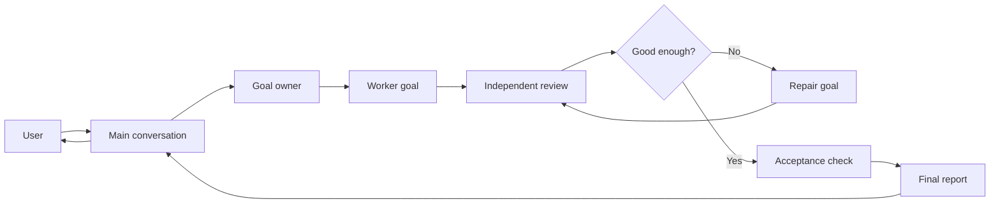
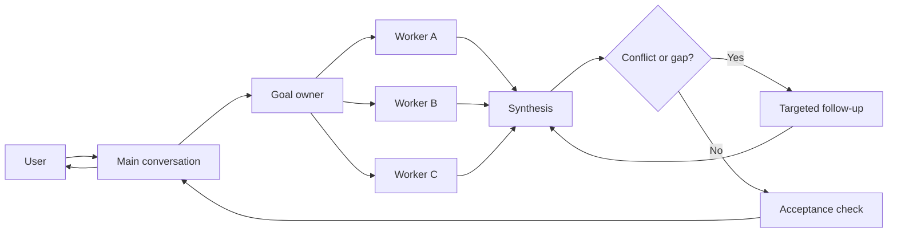
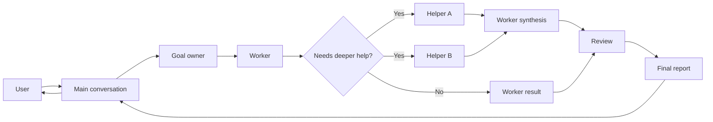

# Parallel Goal Workflows

**[中文说明](README.zh-CN.md)**


Use `parallel-goal-workflows` when one conversation is no longer the right shape
for the work.

Some tasks need exploration, implementation, review, repair, and final judgment.
Putting all of that in the main thread creates noise and makes it harder to see
what is actually done. This skill gives the agent a cleaner way to split broad
work into owned goals, run focused helpers when useful, and return with a short
evidence-backed report.

It is not a command to always use more agents. A single focused worker is fine
when that is enough.

## Install

```bash
npx skills add patrick-fu/parallel-goal-workflows -g
```

Update later:

```bash
npx skills update -g
```

## Quick use

Invoke the skill explicitly, then describe the task, scope, constraints, and
what kind of evidence you expect back.

```text
$parallel-goal-workflows

Audit this repository's authentication flow. I want independent exploration,
implementation-risk review, and a final report with evidence, open risks, and
recommended fixes.
```

Good requests usually include:

- the goal;
- the files, product area, or topic boundaries;
- what requires approval;
- the expected proof, such as diffs, commands, screenshots, citations, or review
  notes;
- what should happen if a helper gets blocked.

## Good fits

- Codebase audits that need independent exploration and review.
- Multi-step implementation work where repair should be checked before it is
  accepted.
- Research tasks where separate sources or viewpoints should be compared.
- Long-running work where intermediate logs would flood the main conversation.
- Any task where the final decision matters more than seeing every helper step
  live in the main thread.

Avoid it for quick edits, simple lookups, small code reviews, or tasks where you
want to stay directly involved in every step.

## What the workflow does

The main conversation stays user-facing. The delegated workflow handles the
working loops:

- turn a broad request into one or more local briefs;
- send focused work to helpers only when that improves the outcome;
- keep review and repair separate enough to catch mistakes;
- check the result against the original goal;
- report back with what changed, what was verified, and what risk remains.

The briefs should be natural task packets, not raw transcripts or role-chain
contracts. A good brief includes the local goal, relevant context, boundaries,
expected output, verification needs, and pause conditions.

## Workflow shapes

These are examples, not scripts. The goal owner chooses the smallest shape that
fits the task.

### Review and repair



### Parallel synthesis



### Nested helpers



## Agent notes

The skill uses a few role names internally:

- Main Agent: stays in the user-facing conversation, starts and tracks delegated
  top-level goals, and relays final handoffs.
- Goal Owner: owns decomposition, coordination, review, repair, acceptance, and
  final judgment for one delegated goal.
- Focused helpers: own local work only and return evidence, verification, risks,
  or decisions for the current assigned goal.

Child roles are examples. A workflow may use researchers, reviewers, verifiers,
implementers, domain specialists, or simpler workers depending on the task.

Visible delegated briefs should not expose raw user transcripts, the full
conversation chain, SKILL.md body text, UI-only directives, or unnecessary parent
role labels. If the host requires `/goal` as runtime syntax, it may appear as the
first line of a delegated packet. Treat that as syntax, not task context.

The Main Agent waits on workflow state, not output volume. It acts on done,
blocked, needs-human, failed sessions, and explicit user requests instead of
reclaiming work just because a helper is quiet.

## Host support

The best experience uses a host that supports explicit skill invocation, goals,
and subagents.

- Claude Code: invoke with `/parallel-goal-workflows`. Claude Code v2.1.172 and
  newer supports nested subagents.
- OpenAI Codex: invoke with `$parallel-goal-workflows`. Codex supports nested
  spawned agents through `agents.max_depth`.

When the host supports history forking, start assigned agents from clean context
instead of forwarding the full main conversation.

A practical Codex configuration is:

```toml
[agents]
max_threads = 50
max_depth = 5

[features]
multi_agent = true
goals = true
```

For more detail, see
[`references/codex-nested-subagents.md`](references/codex-nested-subagents.md).

## More skills

For more reusable agent skills, see
[Awesome Skills](https://github.com/patrick-fu/awesome-skills).
