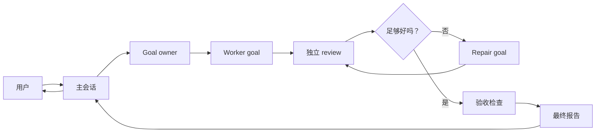
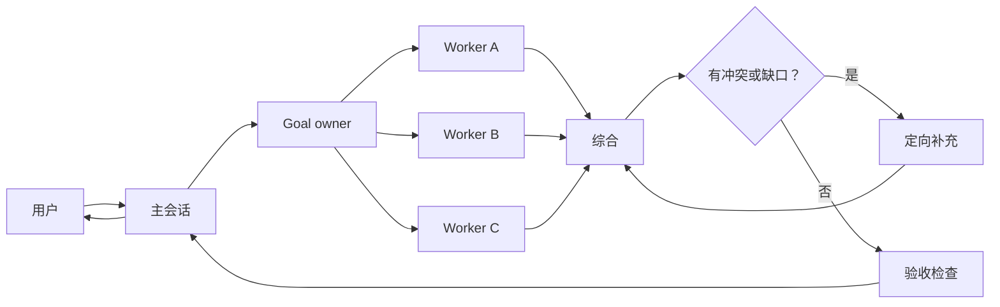
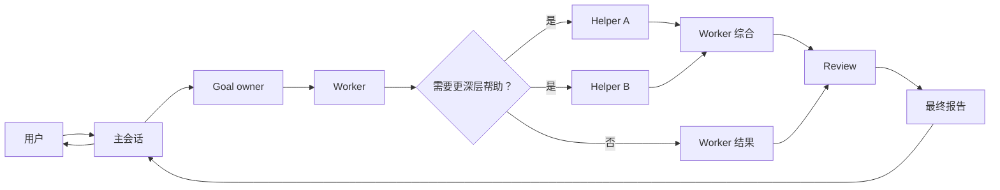

# Parallel Goal Workflows

**[English README](README.md)**


当一个任务已经不适合塞进单个主会话时，用 `parallel-goal-workflows`。

有些任务需要探索、实现、review、repair 和最终判断。如果所有过程都放在主线程里，日志会
越来越多，真正完成了什么反而不清楚。这个 Skill 给 Agent 一套更干净的拆分方式：把宽泛
任务变成有 owner 的目标，在有价值时派出聚焦 helper，最后带着证据和风险回到主会话。

它不是强制并行。一个聚焦 worker 足够时，就用一个。

## 安装

```bash
npx skills add patrick-fu/parallel-goal-workflows -g
```

后续更新：

```bash
npx skills update -g
```

## 快速使用

显式调用这个 Skill，然后说明任务、范围、约束和你希望看到的证据。

```text
$parallel-goal-workflows

审计这个仓库的认证流程。我希望有独立探索、实现风险 review，并最终给我一份包含证据、
未解决风险和推荐修复方案的报告。
```

一个清楚的请求通常会包含：

- 目标；
- 文件、产品区域或主题边界；
- 哪些动作需要用户批准；
- 期望证据，比如 diff、命令、截图、引用或 review notes；
- helper 被阻塞时应该怎么办。

## 适合什么任务

- 需要独立探索和 review 的代码库审计。
- 需要 repair 后再验收的多步骤实现任务。
- 需要比较不同来源或不同视角的 research。
- 中间过程很长，不适合把所有日志塞进主会话的任务。
- 最终判断比实时看见每一步 helper 输出更重要的任务。

不适合快速小改、简单查询、小型 code review，或者你希望主会话直接参与每一步的任务。

## 工作流会做什么

主会话保持面向用户。被委派的 workflow 处理执行循环：

- 把宽泛请求整理成一个或多个本地 brief；
- 只有在能改善结果时才派出 helper；
- 把 review 和 repair 分开，降低遗漏问题的概率；
- 用原始目标检查结果；
- 回报改了什么、验证了什么、还剩什么风险。

brief 应该是自然的任务说明，不是 raw transcript 或角色链路合约。好的 brief 会包含局部
目标、相关上下文、边界、期望输出、验证要求和暂停条件。

## 工作流形态

下面是示例，不是固定脚本。Goal owner 会选择能解决问题的最小形态。

### Review and repair



### Parallel synthesis



### Nested helpers



## Agent notes

这个 Skill 内部会用到几个角色名：

- Main Agent：留在主会话里，启动并追踪被委派的顶层目标，转交最终 handoff。
- Goal Owner：为一个被委派目标负责拆解、协调、review、repair、acceptance 和最终判断。
- Focused helpers：只负责局部工作，并返回证据、验证结果、风险或决策。

子角色只是例子。实际工作里可以按需要使用 researcher、reviewer、verifier、implementer、
领域专家，或者更简单的 worker。

可见 brief 不应该暴露 raw transcript、完整会话链路、SKILL.md 正文、仅面向 UI 的指令或
不必要的父级角色标签。如果宿主需要用 `/goal` 作为 runtime syntax，它可以出现在委派
packet 的第一行，但它不是任务上下文。

Main Agent 等待的是 workflow state，不是输出量。它应根据 done、blocked、needs-human、
session failed 和用户显式请求行动，而不是因为 helper 安静就重新接管。

## 宿主支持

最佳体验需要宿主支持显式 Skill 调用、goals 和 subagents。

- Claude Code：使用 `/parallel-goal-workflows` 调用。Claude Code v2.1.172 及更新版本支持
  嵌套 subagents。
- OpenAI Codex：使用 `$parallel-goal-workflows` 调用。Codex 可通过 `agents.max_depth`
  配置嵌套 spawned agents。

当宿主支持 history fork 时，应从 clean context 启动被分配任务的 agent，而不是转发完整
主会话。

实用的 Codex 配置：

```toml
[agents]
max_threads = 50
max_depth = 5

[features]
multi_agent = true
goals = true
```

更多细节见
[`references/codex-nested-subagents.md`](references/codex-nested-subagents.md)。

## 更多 Skills

更多可复用 Agent Skills 见
[Awesome Skills](https://github.com/patrick-fu/awesome-skills)。
